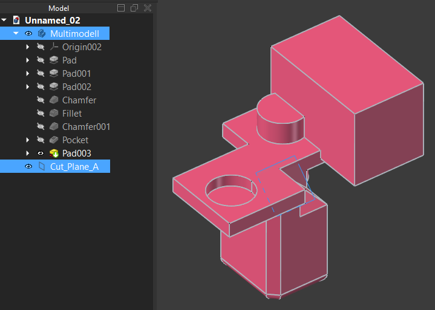
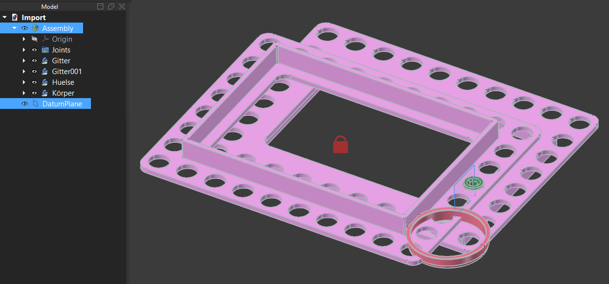
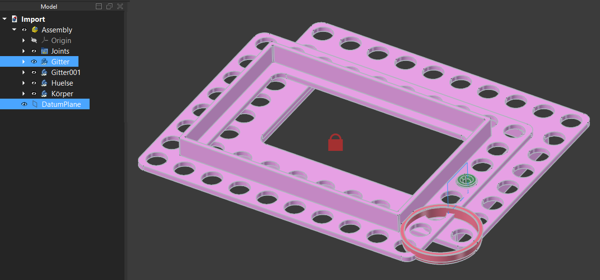
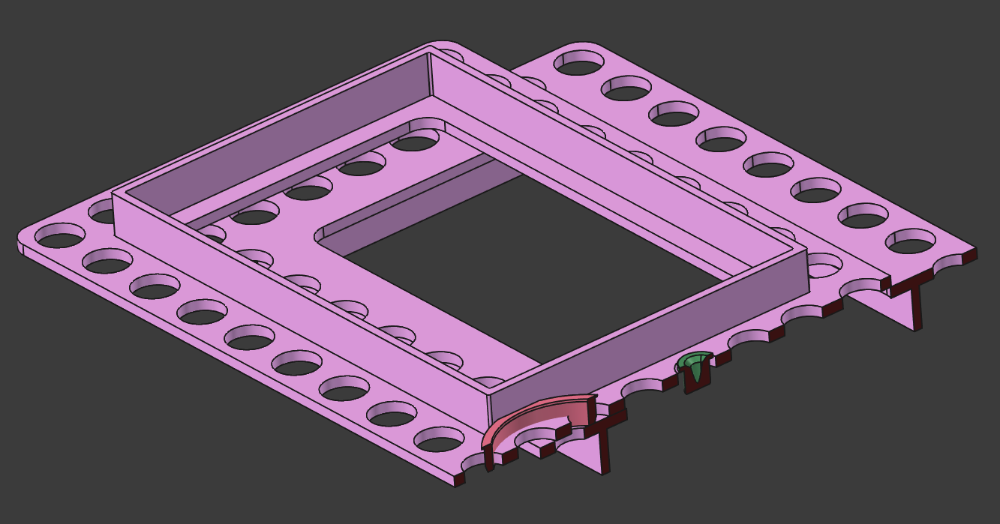

# FreeCAD Macro: Create Cutviews for Assemblies and Parts

This FreeCAD macro automates the creation, management, and deletion of "cut views" for parts and assemblies.  
It is designed for advanced workflows, supporting both single parts and complex assemblies.

---

## Features

- **Automatic creation of cut views** for single bodies or entire assemblies
- **Qt-based user dialog** for easy interaction (choose section letter and cut-cube-size)
- **Delete existing cut-view groups** using a dedicated dialog
- Works with:
  - simple parts or
  - assemblies or
  - parts/links in assemblies

---

## How to Use

### 1. Preparation

- Open a FreeCAD document.
  - create a plane with the exact command "Part_DatumPlane".
  - select a single body **and** a cutting plane to create a new cut view or
  - select an assembly **and** a cutting plane to create a new cut view or
  - select a body/link inside an assembly **and** a cutting plane to create a new cut view.

    or
    
  - only select an existing cutview group to delete it.

> 
> 
> 
> 

---

### 2. Creating a New Cut View

1. **Select object and plane:**  
   In the model tree, select a body/assembly and an existing plane.
2. **Run the macro:**  
   A dialog will appear. Choose a letter for the section label and the cut_cube size
   (if your assambly is bigger, than choose a bigger size).
4. **Confirm your choices:**  
   The macro will automatically generate links/sub-links and the corresponding cut_cubes, and perform the cutting operation.

> 
> 
> 

---

### 3. Deleting an Existing Cutview

- Select a group in the model tree whose name starts with `Cut_` (e.g., `Cut_A`).
- Run the macro again.  
  A dialog will open, giving you the option to delete the entire group.

> ![Select a cut_view_[Letter]-group](images/select_04.png)

---

## Notes & Tips

- Coplanar faces at the cut will be **highlighted in dark red** to improve visibility.
- Objects are automatically grouped under main and subgroups for clarity.
- Works with both individual parts and complex assemblies with nested structures and links.

> 

---

## Installation

1. Copy `ZZZZ_Create_Cutviews_ASM.FCMacro` into your FreeCAD macros folder.
2. Start FreeCAD and execute the macro via the Macro Manager.

---

## Requirements

- FreeCAD (1.1dev+)
- Part and/or PartDesign workbenches enabled
- For assemblies: Internal assembly workbench if required

---

## License

---

## Support / Questions

For issues or suggestions, please open an issue in the [GitHub repository](https://github.com/PuLs4r1203/FreeCAD_Cut_view).
